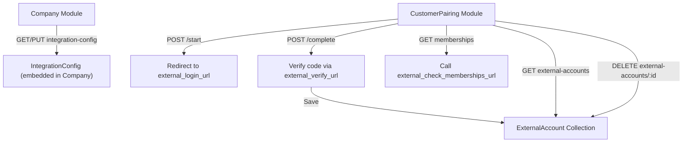

# Implementation Plan: Customer Account Pairing & Membership

## Overview

Fitur ini memungkinkan customer menghubungkan akun mereka di sistem perusahaan eksternal ke akun SaaS, menggunakan OAuth-like flow (redirect → login → code exchange → verify). Setelah paired, SaaS bisa cek status membership/subscription customer dari sistem eksternal.

> [!IMPORTANT]
> Fitur ini **TERPISAH** dari modul `membership` yang sudah ada (code-based membership). Modul existing tetap utuh, fitur baru ini menambah mekanisme **external account pairing** dan **external membership check**.

---

## Dokumen Referensi

| Dokumen | Konten |
|---------|--------|
| **Customer Account Pairing and Membership** | Flow description, business logic, tujuan fitur |
| **Pairing Account And Membership API DOCS** | Schema definitions, 7 API endpoints specification |

---

## Current State Analysis

| Komponen | Status |
|----------|--------|
| `Company` schema | ❌ Belum ada field `IntegrationConfig` |
| `ExternalAccount` schema | ❌ Belum ada |
| `customer-pairing` module | ❌ Belum ada |
| Integration config endpoints | ❌ Belum ada |
| External membership check | ❌ Belum ada |
| Existing `membership` module (code-based) | ✅ Tetap utuh, tidak diubah |

---

## Architecture



---

## Phase 1: Schema & Database Changes

### 1.1 Tambah IntegrationConfig ke Company Schema

**File**: [company.schemas.ts](file:///d:/Perkuliahan/Work%20Order/workorder-portal/src/company/schemas/company.schemas.ts)

Tambah embedded object `integrationConfig` di Company schema:

```typescript
@Prop({
  type: {
    externalLoginUrl: { type: String, default: null },
    externalVerifyUrl: { type: String, default: null },
    externalCheckMembershipsUrl: { type: String, default: null },
    secretKey: { type: String, default: null },
    isIntegrationActive: { type: Boolean, default: false },
  },
  default: {},
  _id: false,
})
integrationConfig: {
  externalLoginUrl: string | null;
  externalVerifyUrl: string | null;
  externalCheckMembershipsUrl: string | null;
  secretKey: string | null;
  isIntegrationActive: boolean;
};
```

> [!NOTE]
> `integrationConfig` di-embed langsung di Company (bukan collection terpisah) karena 1:1 relationship dan selalu diakses bersama Company.

### 1.2 Buat ExternalAccount Schema

**File baru**: `src/customer-pairing/schemas/external-account.schema.ts`

```typescript
@Schema({ timestamps: true })
export class ExternalAccount {
  @Prop({ type: String, required: true })
  externalCustomerEmail: string;

  @Prop({ type: String, required: true })
  externalCustomerName: string;

  @Prop({ type: MongooseSchema.Types.ObjectId, ref: 'Company', required: true })
  companyId: MongooseSchema.Types.ObjectId;

  @Prop({ type: MongooseSchema.Types.ObjectId, ref: 'User', required: true })
  userId: MongooseSchema.Types.ObjectId;

  @Prop({ type: Date, default: () => new Date() })
  pairedAt: Date;

  @Prop({ type: Date, default: null })
  deletedAt: Date;
}
```

> [!TIP]
> `userId` menyimpan referensi ke user SaaS yang melakukan pairing, memungkinkan lookup bidirectional.

---

## Phase 2: Integration Config Endpoints (Company Module)

### 2.1 DTO

**File baru**: `src/company/dto/update-integration-config.dto.ts`

| Field | Type | Validation |
|-------|------|------------|
| `external_login_url` | string (optional) | `@IsOptional()`, `@IsUrl()` |
| `external_verify_url` | string (optional) | `@IsOptional()`, `@IsUrl()` |
| `external_check_memberships_url` | string (optional) | `@IsOptional()`, `@IsUrl()` |
| `secret_key` | string (optional) | `@IsOptional()`, `@IsString()` |
| `is_integration_active` | boolean (optional) | `@IsOptional()`, `@IsBoolean()` |

### 2.2 Endpoints

Tambah di [companies.internal.controller.ts](file:///d:/Perkuliahan/Work%20Order/workorder-portal/src/company/companies.internal.controller.ts):

| Method | Path | Role | Deskripsi |
|--------|------|------|-----------|
| `GET` | `/company/integration-config` | Owner | Get integration config dari company milik user |
| `PUT` | `/company/integration-config` | Owner | Update integration config |

### 2.3 Service Method

Tambah di `companies.internal.service.ts`:
- `getIntegrationConfig(companyId: string)` → return `integrationConfig` field
- `updateIntegrationConfig(companyId: string, dto: UpdateIntegrationConfigDto)` → update embedded object

### 2.4 Resource Transform

Update `CompanyResource.transformCompany()`:
- Strip `integrationConfig.secretKey` dari response (sensitive data, sama seperti `faqApiKey`)
- Atau buat method terpisah `transformIntegrationConfig()` yang khusus untuk endpoint integration-config (owner only, boleh lihat secret)

---

## Phase 3: Customer Pairing Module (Core Feature)

### 3.1 Module Structure

```
src/customer-pairing/
├── customer-pairing.module.ts
├── customer-pairing.controller.ts
├── customer-pairing.service.ts
├── dto/
│   ├── start-pairing.dto.ts
│   └── complete-pairing.dto.ts
├── resources/
│   └── external-account.resource.ts
└── schemas/
    └── external-account.schema.ts
```

### 3.2 DTOs

**`start-pairing.dto.ts`**:

| Field | Type | Validation |
|-------|------|------------|
| `company_id` | string | `@IsMongoId()` |

**`complete-pairing.dto.ts`**:

| Field | Type | Validation |
|-------|------|------------|
| `company_id` | string | `@IsMongoId()` |
| `code` | string | `@IsString()`, `@IsNotEmpty()` |
| `state` | string | `@IsString()`, `@IsNotEmpty()` |

### 3.3 Endpoints

| Method | Path | Auth | Deskripsi |
|--------|------|------|-----------|
| `POST` | `/customer-pairing/start` | Client (authenticated) | Initiate pairing → return `redirect_url` |
| `POST` | `/customer-pairing/complete` | Client (authenticated) | Complete pairing dengan code dari external |

### 3.4 Service Logic

#### `startPairing(dto, user)`
1. Cari Company by `dto.company_id`
2. Validasi `integrationConfig.isIntegrationActive === true`
3. Generate random `state` token, simpan sementara (cache/DB) untuk verifikasi nanti
4. Build `redirect_url`: `${integrationConfig.externalLoginUrl}?redirect_uri=${SAAS_CALLBACK_URL}&state=${state}`
5. Return `{ redirect_url }`

#### `completePairing(dto, user)`
1. Validasi `state` (cocok dengan yang di-generate saat start)
2. Cari Company by `dto.company_id`, ambil `integrationConfig`
3. HTTP POST ke `integrationConfig.externalVerifyUrl` dengan `code` + `secret_key`
4. External system return `{ email, name }` (profil customer)
5. Cek apakah sudah ada ExternalAccount dengan email + companyId yang sama
6. Jika belum, create ExternalAccount baru (link userId SaaS ↔ external email)
7. Return `{ success: true, external_account: ExternalAccount }`

> [!WARNING]
> State token harus di-validate untuk mencegah CSRF. Opsi penyimpanan: in-memory cache (sederhana) atau collection MongoDB terpisah dengan TTL index.

---

## Phase 4: External Accounts Management

### 4.1 Endpoints

Tambah di `customer-pairing.controller.ts`:

| Method | Path | Role | Deskripsi |
|--------|------|------|-----------|
| `GET` | `/companies/:id/external-accounts` | Owner, Manager | List semua paired accounts untuk company |
| `DELETE` | `/external-accounts/:id` | Owner, Manager, Client (own) | Unpair/detach external account |

### 4.2 Service Logic

#### `findAllByCompany(companyId)`
- Query ExternalAccount where `companyId` + `deletedAt: null`
- Populate `userId` (nama, email user SaaS)

#### `unpair(externalAccountId, user)`
- Soft delete (set `deletedAt`)
- Authorization: Owner/Manager bisa unpair siapa saja di company-nya, Client hanya bisa unpair milik sendiri

### 4.3 Resource Transform

**`external-account.resource.ts`**:

```typescript
static transform(account: any) {
  return {
    _id: account._id,
    external_customer_email: account.externalCustomerEmail,
    external_customer_name: account.externalCustomerName,
    company: account.companyId, // populated
    paired_at: account.pairedAt,
  };
}
```

---

## Phase 5: External Membership Check

### 5.1 Endpoint

| Method | Path | Role | Deskripsi |
|--------|------|------|-----------|
| `GET` | `/companies/:id/memberships` | Owner, Manager | Fetch membership status dari external system |

### 5.2 Service Logic

#### `checkExternalMemberships(companyId)`
1. Ambil Company + `integrationConfig`
2. Ambil semua ExternalAccount untuk company tersebut
3. HTTP GET/POST ke `integrationConfig.externalCheckMembershipsUrl` dengan list `external_customer_email` + `secret_key`
4. Return array of membership objects dari external system (pass-through, format tergantung external API)

> [!NOTE]
> Response dari external system di-pass-through langsung. Jika perlu normalisasi, buat transformer terpisah.

---

## Phase 6: Module Registration & Wiring

### 6.1 Update `app.module.ts`

Register `CustomerPairingModule` di imports.

### 6.2 `customer-pairing.module.ts`

```typescript
@Module({
  imports: [
    MongooseModule.forFeature([
      { name: ExternalAccount.name, schema: ExternalAccountSchema },
      { name: Company.name, schema: CompanySchema },
    ]),
    HttpModule, // untuk HTTP calls ke external system
    forwardRef(() => AuthModule),
    forwardRef(() => UsersModule),
  ],
  controllers: [CustomerPairingController],
  providers: [CustomerPairingService],
  exports: [CustomerPairingService],
})
```

---

## Execution Order

| Step | Phase | Files | Estimasi |
|------|-------|-------|----------|
| 1 | Schema Changes | `company.schemas.ts`, `external-account.schema.ts` | ~15 min |
| 2 | Integration Config DTO + Endpoints | `update-integration-config.dto.ts`, `companies.internal.controller.ts`, `companies.internal.service.ts` | ~20 min |
| 3 | Customer Pairing Module (start/complete) | Seluruh `customer-pairing/` directory | ~40 min |
| 4 | External Accounts CRUD | Tambah endpoints di controller + service | ~15 min |
| 5 | External Membership Check | Tambah endpoint + HTTP client logic | ~15 min |
| 6 | Module Wiring + Testing | `app.module.ts`, manual API testing | ~15 min |

**Total estimasi: ~2 jam**

---

## Decisions & Assumptions

1. **IntegrationConfig di-embed di Company** (bukan collection terpisah) → simplicity, 1:1 relationship
2. **State token** untuk CSRF protection disimpan di MongoDB (collection terpisah dengan TTL) agar persist across restarts
3. **ExternalAccount** disimpan di collection baru (bukan di Company) → 1:N relationship (banyak customer per company)
4. **Soft delete** untuk ExternalAccount (konsisten dengan pattern existing)
5. **snake_case** untuk API response keys (konsisten dengan konvensi project)
6. **HttpModule** (@nestjs/axios) untuk HTTP calls ke external system
