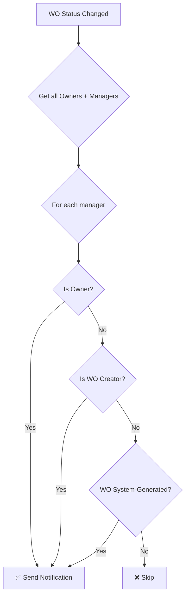
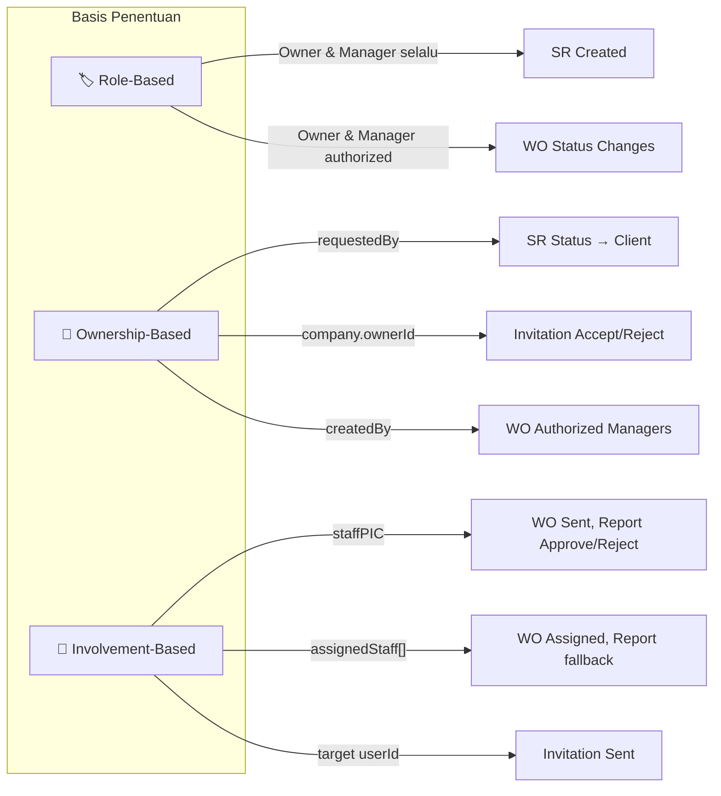

# Notification Recipients Map — Work Order Portal

Dokumentasi lengkap penerima notifikasi berdasarkan **role**, **ownership item**, dan **keterlibatan** di setiap modul.

---

## Roles dalam Sistem

| Role | Enum Value | Keterangan |
|------|------------|------------|
| Client | `client` | Pemohon layanan (external) |
| Company Owner | `owner_company` | Pemilik perusahaan penyedia |
| Company Manager | `manager_company` | Manajer perusahaan penyedia |
| Company Staff | `staff_company` | Staf operasional |
| Unassigned Staff | `staff_unassigned` | Staf belum terdaftar di perusahaan |

---

## 1. Service Request Module

### 1.1 Submit Intake (Client membuat SR baru)
[service-request.service.ts:L192–L212](file:///d:/Perkuliahan/Work%20Order/workorder-portal/src/service-request/service-request.service.ts#L192-L212)

| Penerima | Basis | Kondisi |
|----------|-------|---------|
| **Client (Requester)** | Ownership — `requestedBy` | Selalu dikirim |
| **Owner + Manager** perusahaan penyedia | Role — `CompanyOwner`, `CompanyManager` | Selalu dikirim ke semua Owner/Manager di `companyId` layanan |

### 1.2 Update Status (Internal — approve/reject/cancel)
[service-request.service.ts:L629–L643](file:///d:/Perkuliahan/Work%20Order/workorder-portal/src/service-request/service-request.service.ts#L629-L643)

| Penerima | Basis | Kondisi |
|----------|-------|---------|
| **Client (Requester)** | Ownership — `requestedBy` | Selalu dikirim saat status berubah |

### 1.3 Update SR Status Systemically (otomatis dari WO lifecycle)
[service-request.service.ts:L534–L548](file:///d:/Perkuliahan/Work%20Order/workorder-portal/src/service-request/service-request.service.ts#L534-L548)

| Penerima | Basis | Kondisi |
|----------|-------|---------|
| **Client (Requester)** | Ownership — `requestedBy` | Dipicu otomatis saat semua WO dalam SR selesai/gagal |

### 1.4 Submit Review (Client mengirim ulasan)
[service-request.service.ts:L335–L352](file:///d:/Perkuliahan/Work%20Order/workorder-portal/src/service-request/service-request.service.ts#L335-L352)

| Penerima | Basis | Kondisi |
|----------|-------|---------|
| **Owner + Manager** perusahaan penyedia | Role — `CompanyOwner`, `CompanyManager` | Selalu dikirim ke semua Owner/Manager |

### 1.5 Assign Staff PIC (SR)
[service-request.service.ts:L746–L753](file:///d:/Perkuliahan/Work%20Order/workorder-portal/src/service-request/service-request.service.ts#L746-L753)

| Penerima | Basis | Kondisi |
|----------|-------|---------|
| **Staff PIC** yang ditunjuk | Keterlibatan — `staffPIC` | Hanya jika `staffPIC` di-set |

---

## 2. Work Order Module

### 2.1 Mark as Sent (WO dikirim ke staff)
[work-order.service.ts:L679–L701](file:///d:/Perkuliahan/Work%20Order/workorder-portal/src/work-order/work-order.service.ts#L679-L701)

| Penerima | Basis | Kondisi |
|----------|-------|---------|
| **Staff PIC** | Keterlibatan — `staffPIC` | Jika `staffPIC` ada |
| **Assigned Staff** (semua) | Keterlibatan — `assignedStaff[]` | Jika bukan PIC (menghindari duplikat) |

> [!NOTE]
> Jika WO menggunakan approval `AUTO`, status langsung menjadi `APPROVED` dan notifikasi bertuliskan "Perintah Kerja Disetujui". Jika manual, status menjadi `SENT` dan bertuliskan "Perintah Kerja Baru".

### 2.2 Assign Staff (WO)
[work-order.service.ts:L595–L617](file:///d:/Perkuliahan/Work%20Order/workorder-portal/src/work-order/work-order.service.ts#L595-L617)

| Penerima | Basis | Kondisi |
|----------|-------|---------|
| **Staff PIC** baru | Keterlibatan — `staffPIC` | Hanya jika WO **bukan** `DRAFTED` |
| **Assigned Staff** baru | Keterlibatan — `assignedStaff[]` | Hanya jika WO **bukan** `DRAFTED` |

> [!IMPORTANT]
> Notifikasi **tidak** dikirim saat WO masih `DRAFTED` agar staf tidak menerima notifikasi sebelum WO resmi dikirim.

### 2.3 Approve / Reject WO (oleh Staff PIC)
[work-order.service.ts:L724–L757](file:///d:/Perkuliahan/Work%20Order/workorder-portal/src/work-order/work-order.service.ts#L724-L757)

| Penerima | Basis | Kondisi |
|----------|-------|---------|
| **Authorized Managers** | Role + Ownership (lihat detail di bawah) | Selalu dikirim |

### 2.4 Start WO (Staff mulai mengerjakan)
[work-order.service.ts:L899–L905](file:///d:/Perkuliahan/Work%20Order/workorder-portal/src/work-order/work-order.service.ts#L899-L905)

| Penerima | Basis | Kondisi |
|----------|-------|---------|
| **Authorized Managers** | Role + Ownership | Selalu dikirim |

### 2.5 Complete / Fail WO
[work-order.service.ts:L934–L977](file:///d:/Perkuliahan/Work%20Order/workorder-portal/src/work-order/work-order.service.ts#L934-L977)

| Penerima | Basis | Kondisi |
|----------|-------|---------|
| **Authorized Managers** | Role + Ownership | Selalu dikirim |

### 2.6 Update Status WO (generic)
[work-order.service.ts:L516–L523](file:///d:/Perkuliahan/Work%20Order/workorder-portal/src/work-order/work-order.service.ts#L516-L523)

| Penerima | Basis | Kondisi |
|----------|-------|---------|
| **Authorized Managers** | Role + Ownership | Selalu dikirim |

### 2.7 Cancel WO

| Penerima | Basis | Kondisi |
|----------|-------|---------|
| **Staff PIC** | Keterlibatan — `staffPIC` | Jika `staffPIC` ada |
| **Assigned Staff** (semua) | Keterlibatan — `assignedStaff[]` | Hanya jika tidak ada `staffPIC` (fallback) |

### 2.8 Recreate WO (dari WO yang ditolak)

| Penerima | Basis | Kondisi |
|----------|-------|---------|
| **Authorized Managers** | Role + Ownership | Selalu dikirim |

### Definisi "Authorized Managers"
[work-order.service.ts:L1162–L1183](file:///d:/Perkuliahan/Work%20Order/workorder-portal/src/work-order/work-order.service.ts#L1162-L1183)

Helper `_notifyAuthorizedManagers` mengirim notifikasi ke user dengan role `CompanyOwner` atau `CompanyManager` di perusahaan yang sama, **tetapi hanya jika memenuhi salah satu**:

| Kondisi | Penjelasan |
|---------|------------|
| `isOwner` | User adalah Company Owner |
| `isCreator` | User adalah pembuat WO (`createdBy` === manager._id) |
| `isSystemGenerated` | WO dibuat otomatis oleh sistem (`createdBy` === null) — **semua** manager diberitahu |

---

## 3. Work Report Module

### 3.1 Mark as Sent / Submit Report
[work-report.service.ts:L270–L306](file:///d:/Perkuliahan/Work%20Order/workorder-portal/src/work-report/work-report.service.ts#L270-L306)

**Jika approval mode MANUAL** (status → `SUBMITTED`):

| Penerima | Basis | Kondisi |
|----------|-------|---------|
| **Owner + Manager + WO Creator + WO PIC** | Role + Ownership + Keterlibatan | Harus memenuhi: `isOwner` ATAU `isCreator` ATAU `isSystemGenerated` ATAU `isPIC` |

**Jika approval mode AUTO** (status → `APPROVED`):

| Penerima | Basis | Kondisi |
|----------|-------|---------|
| **Staff PIC** (atau semua `assignedStaff` jika tidak ada PIC) | Keterlibatan | Diberitahu bahwa laporan disetujui otomatis |

### 3.2 Approve Report (manual oleh Manager/Owner)
[work-report.service.ts:L332–L345](file:///d:/Perkuliahan/Work%20Order/workorder-portal/src/work-report/work-report.service.ts#L332-L345)

| Penerima | Basis | Kondisi |
|----------|-------|---------|
| **Staff PIC** (atau `assignedStaff` jika tidak ada PIC) | Keterlibatan | Selalu dikirim |

### 3.3 Reject Report (manual oleh Manager/Owner)
[work-report.service.ts:L370–L383](file:///d:/Perkuliahan/Work%20Order/workorder-portal/src/work-report/work-report.service.ts#L370-L383)

| Penerima | Basis | Kondisi |
|----------|-------|---------|
| **Staff PIC** (atau `assignedStaff` jika tidak ada PIC) | Keterlibatan | Selalu dikirim |

---

## 4. Invitation Module

### 4.1 Invite Employees (Owner mengundang staf)
[companies.internal.service.ts:L199–L205](file:///d:/Perkuliahan/Work%20Order/workorder-portal/src/company/companies.internal.service.ts#L199-L205)

| Penerima | Basis | Kondisi |
|----------|-------|---------|
| **User yang diundang** | Target — `userId` dari undangan | Per undangan |

### 4.2 Accept Invitation
[invitations.service.ts:L183–L192](file:///d:/Perkuliahan/Work%20Order/workorder-portal/src/invitations/invitations.service.ts#L183-L192)

| Penerima | Basis | Kondisi |
|----------|-------|---------|
| **Company Owner** | Ownership — `company.ownerId` | Selalu dikirim |

### 4.3 Reject Invitation
[invitations.service.ts:L255–L264](file:///d:/Perkuliahan/Work%20Order/workorder-portal/src/invitations/invitations.service.ts#L255-L264)

| Penerima | Basis | Kondisi |
|----------|-------|---------|
| **Company Owner** | Ownership — `company.ownerId` | Selalu dikirim |

---

## Summary Matrix

Matriks ringkasan siapa yang menerima notifikasi pada setiap event:

| Event | Client | Owner | Manager | Staff PIC | Assigned Staff |
|-------|:------:|:-----:|:-------:|:---------:|:--------------:|
| **SR Created** | ✅ | ✅ | ✅ | — | — |
| **SR Status Updated** | ✅ | — | — | — | — |
| **SR Review Submitted** | — | ✅ | ✅ | — | — |
| **SR Staff PIC Assigned** | — | — | — | ✅ | — |
| **WO Sent/Approved** | — | — | — | ✅ | ✅ |
| **WO Staff Assigned** | — | — | — | ✅ | ✅ |
| **WO Approve/Reject (by PIC)** | — | ✅¹ | ✅¹ | — | — |
| **WO Started** | — | ✅¹ | ✅¹ | — | — |
| **WO Completed/Failed** | — | ✅¹ | ✅¹ | — | — |
| **WO Cancelled** | — | — | — | ✅ | ✅² |
| **WO Recreated** | — | ✅¹ | ✅¹ | — | — |
| **Report Submitted (manual)** | — | ✅¹ | ✅¹ | — | — |
| **Report Submitted (auto)** | — | — | — | ✅ | ✅² |
| **Report Approved** | — | — | — | ✅ | ✅² |
| **Report Rejected** | — | — | — | ✅ | ✅² |
| **Invitation Sent** | — | — | — | — | ✅³ |
| **Invitation Accepted** | — | ✅ | — | — | — |
| **Invitation Rejected** | — | ✅ | — | — | — |

> **Keterangan:**
> - ✅¹ = Hanya **Authorized Managers** (Owner selalu, Manager jika creator atau WO system-generated)
> - ✅² = Hanya jika **tidak ada Staff PIC** (fallback ke `assignedStaff`)
> - ✅³ = User target undangan (bisa `staff_unassigned`)

---

## Prinsip Routing Notifikasi

