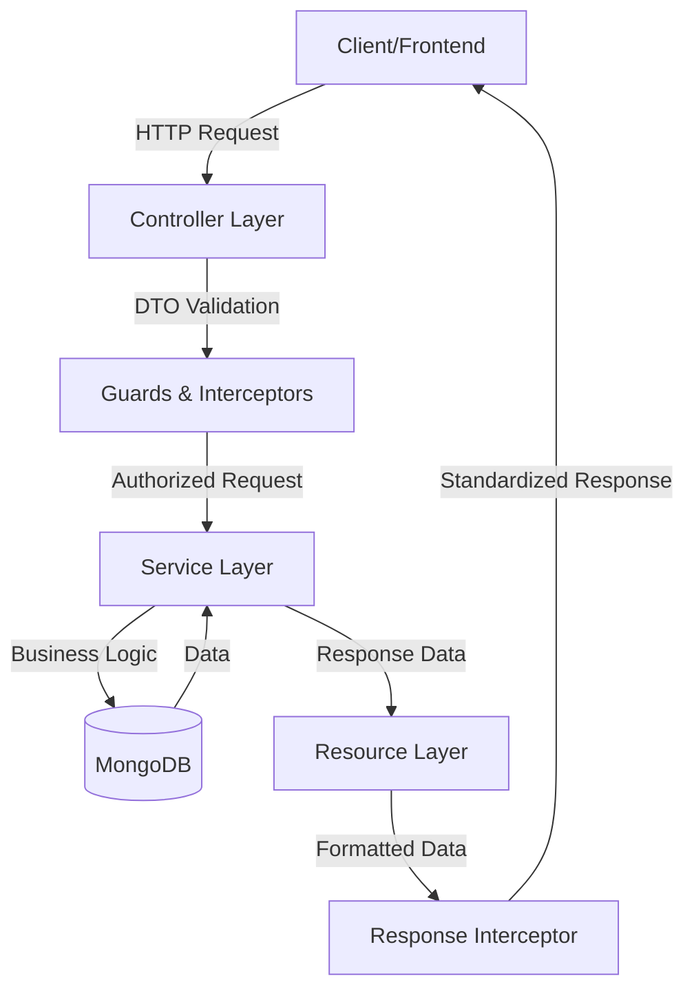
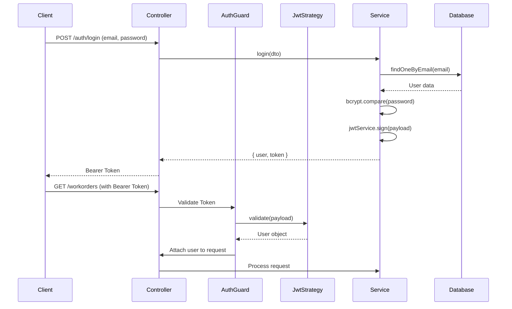
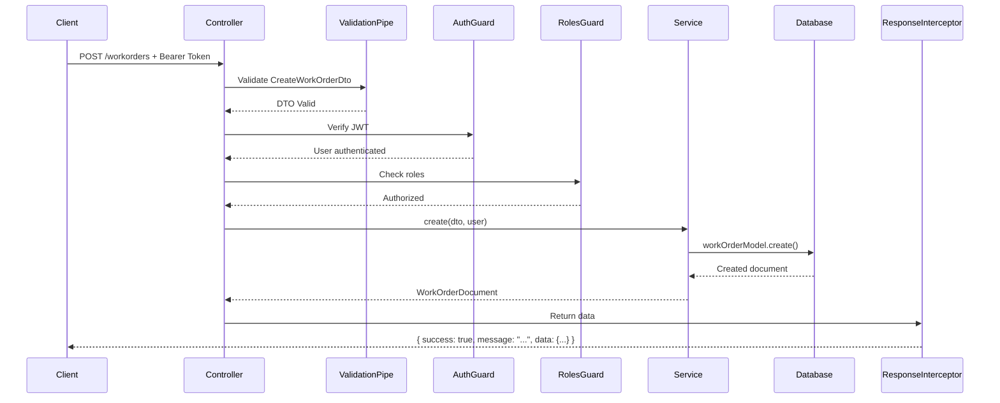

# 🏗️ Arsitektur Work Order Portal - Dokumentasi Lengkap

## 📋 Ringkasan Proyek

**Work Order Portal** adalah aplikasi backend berbasis **NestJS** yang dirancang untuk mengelola sistem work order perusahaan. Aplikasi ini menggunakan arsitektur **modular** dengan pola **layered architecture** dan menerapkan prinsip **separation of concerns**.

---

## 🎯 Arsitektur Sistem

### 1. **Arsitektur Utama: Modular Layered Architecture**

Proyek ini menggunakan **Modular Layered Architecture** dengan struktur sebagai berikut:



### 2. **Layer-Layer Aplikasi**

#### **Layer 1: Entry Point**
- **File**: `src/main.ts`
- **Fungsi**: Bootstrap aplikasi NestJS
- **Proses**:
  1. Membuat instance aplikasi dengan `NestFactory.create(AppModule)`
  2. Memanggil `setupApp()` untuk konfigurasi global
  3. Menjalankan server pada port yang ditentukan (default: 3000)

#### **Layer 2: Application Setup**
- **File**: `src/app-setup.ts`
- **Fungsi**: Konfigurasi global aplikasi
- **Komponen**:
  - **ValidationPipe**: Validasi otomatis untuk semua DTO
  - **CORS**: Mengizinkan cross-origin requests
  - **ResponseInterceptor**: Standarisasi format response
  - **HttpExceptionFilter**: Penanganan error global

#### **Layer 3: Core Module**
- **File**: `src/core/core.module.ts`
- **Fungsi**: Modul inti yang menyediakan konfigurasi fundamental
- **Komponen**:
  - **ConfigModule**: Manajemen environment variables (`.env`)
  - **MongooseModule**: Koneksi ke database MongoDB

#### **Layer 4: Feature Modules**
Aplikasi dibagi menjadi beberapa modul fitur yang dikelompokkan:

##### **A. Organization Module** (`src/organization/`)
Mengelola struktur organisasi:
- **CompaniesModule**: Manajemen perusahaan
- **PositionsModule**: Manajemen posisi/jabatan
- **InvitationsModule**: Sistem undangan karyawan

##### **B. Operations Module** (`src/operations/`)
Mengelola operasional bisnis:
- **WorkOrderModule**: Manajemen work order
- **WorkReportModule**: Manajemen laporan kerja
- **ClientServiceRequestModule**: Permintaan layanan dari klien
- **ServicesModule**: Katalog layanan perusahaan

##### **C. Supporting Modules**
- **AuthModule**: Autentikasi & otorisasi
- **UsersModule**: Manajemen pengguna
- **FormModule**: Sistem formulir dinamis
- **MembershipModule**: Manajemen keanggotaan

---

## 🔐 Sistem Autentikasi & Otorisasi

### **1. Authentication Flow**



### **2. Authorization (Role-Based Access Control)**

**Roles yang tersedia**:
```typescript
enum Role {
  Client = 'client',
  AppAdmin = 'app_admin',
  CompanyOwner = 'owner_company',
  CompanyManager = 'manager_company',
  CompanyStaff = 'staff_company',
  UnassignedStaff = 'unassigned_staff'
}
```

**Cara Kerja**:
1. **AuthGuard**: Memverifikasi JWT token dan mengekstrak user
2. **RolesGuard**: Memeriksa apakah role user sesuai dengan `@Roles()` decorator
3. Jika tidak sesuai, melempar `ForbiddenException`

**Contoh Implementasi**:
```typescript
@Controller('workorders')
@UseGuards(AuthGuard, RolesGuard)
@Roles(Role.CompanyOwner, Role.CompanyManager, Role.CompanyStaff)
export class WorkOrderInternalController {
  // Hanya owner, manager, dan staff yang bisa akses
}
```

---

## 🗄️ Database & Schema Design

### **1. Koneksi Database**

**Konfigurasi** (`src/core/core.module.ts`):
```typescript
MongooseModule.forRootAsync({
  useFactory: async (configService: ConfigService) => ({
    uri: configService.get<string>('MONGO_URI'),
  }),
  inject: [ConfigService],
})
```

**Environment Variable** (`.env`):
```
MONGO_URI=mongodb://localhost:27017/workorder
```

### **2. Schema Utama**

#### **User Schema** (`src/users/schemas/user.schema.ts`)
```typescript
{
  name: string,
  email: string (unique, indexed),
  password: string (hashed dengan bcrypt),
  role: enum Role,
  companyId: ObjectId (ref: Company),
  positionId: ObjectId (ref: Position),
  deletedAt: Date (soft delete)
}
```

**Fitur Khusus**:
- Password otomatis di-hash sebelum disimpan (pre-save hook)
- Soft delete dengan field `deletedAt`

#### **Work Order Schema** (`src/work-order/schemas/work-order.schema.ts`)
```typescript
{
  clientServiceRequestId: ObjectId (ref: ClientServiceRequest),
  createdBy: ObjectId (ref: User),
  serviceId: ObjectId (ref: Service),
  companyId: ObjectId (ref: Company),
  relatedWorkOrderId: ObjectId (ref: WorkOrder),
  assignedStaffs: [ObjectId] (ref: User),
  workOrderForms: [WorkOrderFormSnapshot],
  status: string (drafted, ready, in_progress, completed),
  startedAt: Date,
  completedAt: Date,
  deletedAt: Date
}
```

**Nested Schema**:
- `WorkOrderFormSnapshot`: Snapshot formulir yang terkait
- `FormSnapshot`: Detail formulir (title, description, formType)

#### **Invitation Schema** (`src/company/schemas/invitation.schema.ts`)
```typescript
{
  companyId: ObjectId (ref: Company),
  userId: ObjectId (ref: User),
  role: string,
  status: string (pending, accepted, rejected, expired),
  positionId: ObjectId (ref: Position),
  expiresAt: Date,
  deletedAt: Date
}
```

---

## 🔄 Request Flow (Contoh: Create Work Order)



### **Detail Setiap Tahap**:

1. **Client Request**
   - HTTP Method: POST
   - Endpoint: `/workorders`
   - Headers: `Authorization: Bearer <token>`
   - Body: JSON sesuai `CreateWorkOrderDto`

2. **Validation Layer**
   - `ValidationPipe` memvalidasi DTO menggunakan `class-validator`
   - Jika gagal, return error dengan format standar

3. **Authentication Layer**
   - `AuthGuard` mengekstrak token dari header
   - Memverifikasi signature dan expiration
   - Memanggil `JwtStrategy.validate()` untuk mendapatkan user
   - Menambahkan user ke `request.user`

4. **Authorization Layer**
   - `RolesGuard` membaca `@Roles()` decorator
   - Membandingkan dengan `request.user.role`
   - Jika tidak cocok, throw `ForbiddenException`

5. **Service Layer**
   - Menerima DTO dan authenticated user
   - Menjalankan business logic
   - Berinteraksi dengan database melalui Mongoose model
   - Return data mentah

6. **Response Layer**
   - `ResponseInterceptor` membungkus response dengan format standar:
   ```json
   {
     "success": true,
     "message": "Work Order created successfully",
     "data": { ... }
   }
   ```

---

## 🛡️ Guards & Interceptors

### **1. AuthGuard** (`src/auth/guards/auth.guard.ts`)
- Extends `PassportAuthGuard('jwt')`
- Menggunakan JWT strategy dari Passport
- Otomatis memverifikasi token dan menambahkan user ke request

### **2. RolesGuard** (`src/auth/guards/roles.guard.ts`)
- Membaca metadata dari `@Roles()` decorator
- Memeriksa apakah user memiliki role yang sesuai
- Throw `ForbiddenException` jika tidak authorized

### **3. ResponseInterceptor** (`src/common/interceptors/response.interceptor.ts`)
- Mengubah semua response sukses ke format standar
- Format:
  ```typescript
  {
    success: true,
    message: string,
    data: any
  }
  ```

### **4. HttpExceptionFilter** (`src/common/filters/http-exception.filter.ts`)
- Menangkap semua exception
- Mengubah error ke format standar
- Format:
  ```typescript
  {
    success: false,
    message: string,
    code: string,
    errors: any
  }
  ```

---

## 📦 Module Structure (Contoh: Work Order Module)

```
src/work-order/
├── dto/
│   ├── create-work-order.dto.ts
│   ├── update-work-order.dto.ts
│   ├── assign-staff.dto.ts
│   └── work-order-filter.dto.ts
├── schemas/
│   └── work-order.schema.ts
├── resources/
│   └── work-order.resource.ts
├── work-order.module.ts
├── work-order.service.ts
├── work-order.internal.controller.ts
└── work-order.staff.controller.ts
```

### **Komponen**:

1. **DTOs (Data Transfer Objects)**
   - Validasi input dari client
   - Menggunakan `class-validator` decorators
   - Contoh: `@IsString()`, `@IsNotEmpty()`, `@IsEnum()`

2. **Schemas**
   - Definisi struktur data MongoDB
   - Menggunakan Mongoose decorators
   - Mendefinisikan relasi antar collection

3. **Resources**
   - Transform data dari database ke format response
   - Menyembunyikan field sensitif
   - Populate relasi yang diperlukan

4. **Services**
   - Business logic utama
   - Interaksi dengan database
   - Validasi bisnis rules
   - Contoh methods:
     - `create()`: Membuat work order baru
     - `findAllInternal()`: List work order untuk internal company
     - `assignStaff()`: Assign staff ke work order
     - `markAsReady()`: Ubah status ke ready

5. **Controllers**
   - Routing HTTP requests
   - Menerapkan guards dan decorators
   - Memanggil service methods
   - Return response melalui `ResponseUtil`

---

## 🔧 Utility & Helper

### **1. ResponseUtil** (`src/common/utils/response.util.ts`)
```typescript
ResponseUtil.success(message: string, data: any)
// Returns: { success: true, message, data }
```

### **2. Resource Pattern**
Mengubah data database ke format yang siap dikonsumsi client:
```typescript
WorkOrderResource.collection(workOrders)
WorkOrderResource.single(workOrder)
```

---

## 🌐 API Endpoints (Contoh Work Order)

### **Internal Endpoints** (Untuk company staff)
```
POST   /workorders              - Create work order
GET    /workorders              - List all work orders (with filters)
GET    /workorders/:id          - Get work order detail
PATCH  /workorders/:id          - Update work order
PATCH  /workorders/:id/status   - Update status
PUT    /workorders/:id/assign-staffs - Assign staff
PUT    /workorders/:id/submissions  - Create form submissions
PUT    /workorders/:id/ready    - Mark as ready
PUT    /workorders/:id/start    - Mark as in progress
DELETE /workorders/:id          - Soft delete work order
GET    /workorders/:id/report   - Get work report
PUT    /workorders/:id/report   - Submit work report form
```

### **Staff Endpoints** (Untuk assigned staff)
```
GET    /my/workorders           - List assigned work orders
GET    /my/workorders/:id       - Get assigned work order detail
```

---

## 🔄 Data Flow Patterns

### **1. Soft Delete Pattern**
Semua penghapusan menggunakan soft delete:
```typescript
async remove(id: string) {
  const deletedAt = new Date();
  await this.model.findByIdAndUpdate(id, { deletedAt });
  return { deletedAt };
}
```

### **2. Population Pattern**
Mengisi relasi dengan data lengkap:
```typescript
const workOrder = await this.workOrderModel
  .findById(id)
  .populate('assignedStaffs', 'name email')
  .populate('serviceId', 'name description')
  .exec();
```

### **3. Aggregation Pattern**
Untuk query kompleks:
```typescript
const results = await this.model.aggregate([
  { $match: { companyId: user.companyId } },
  { $lookup: { from: 'users', localField: 'assignedStaffs', foreignField: '_id', as: 'staffs' } },
  { $project: { ... } }
]);
```

---

## 🔐 Security Features

1. **Password Hashing**: Bcrypt dengan salt rounds 10
2. **JWT Authentication**: Token-based dengan expiration
3. **Role-Based Access Control**: Multi-level authorization
4. **Input Validation**: Automatic DTO validation
5. **CORS**: Configured untuk production
6. **Soft Delete**: Data tidak benar-benar dihapus

---

## 📊 Database Seeding

**File**: `src/database/seed.ts`

**Commands**:
```bash
npm run seed          # Populate database dengan data dummy
npm run seed:clear    # Hapus semua data
npm run seed:status   # Cek status seeding
```

---

## 🚀 Deployment

**Platform**: Vercel (Serverless)

**File Konfigurasi**: `vercel.json`
```json
{
  "version": 2,
  "builds": [{ "src": "dist/main.js", "use": "@vercel/node" }],
  "routes": [{ "src": "/(.*)", "dest": "dist/main.js" }]
}
```

---

## 📝 Kesimpulan

Work Order Portal menggunakan arsitektur yang:
- ✅ **Modular**: Setiap fitur dalam module terpisah
- ✅ **Scalable**: Mudah menambah fitur baru
- ✅ **Maintainable**: Separation of concerns yang jelas
- ✅ **Secure**: Multi-layer security (auth, authorization, validation)
- ✅ **Standardized**: Response & error handling yang konsisten
- ✅ **Type-Safe**: TypeScript untuk type checking
- ✅ **Database-Agnostic**: Menggunakan ODM (Mongoose) untuk abstraksi
